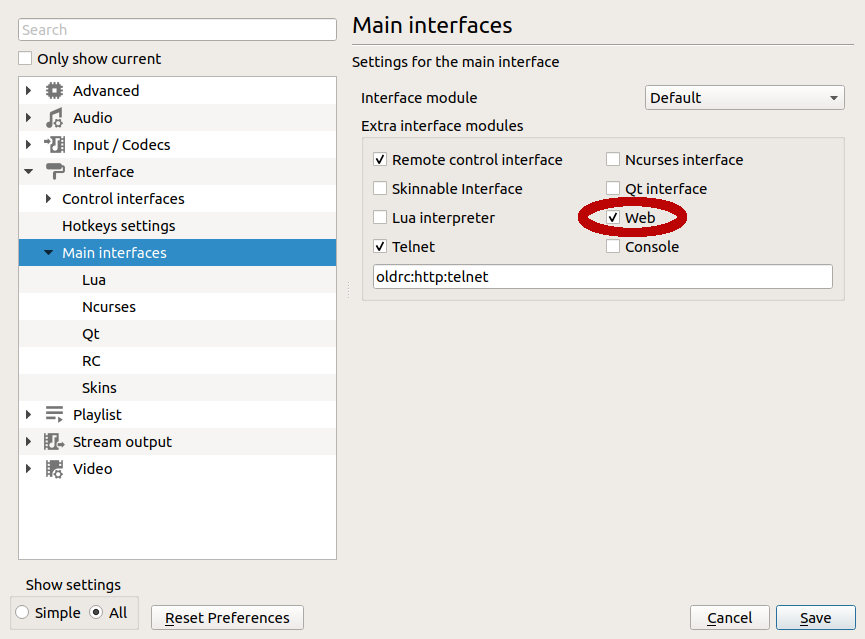
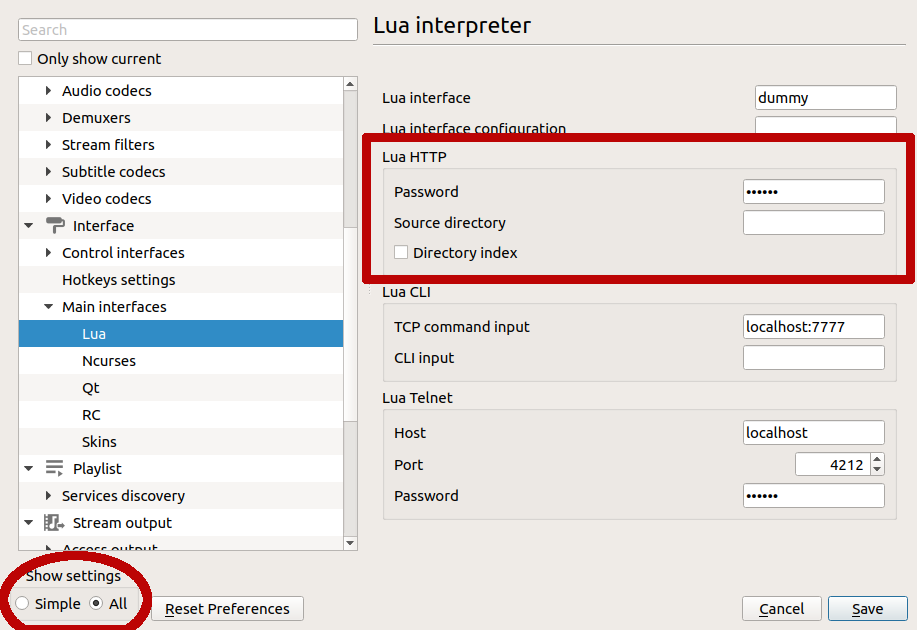

# VLC Media Player   
VLC is a free and open source cross-platform multimedia player and framework that plays most multimedia files as well as DVDs, Audio CDs, VCDs, and various streaming protocols.

You can find it here: <a href="https://www.videolan.org/vlc/index.html" title="VLC">videolan.org</a>

## Configuration
If you can successfully connect to VLC with a browser, this module will work. Enter the same information from the URL.

Setting | Description
-----------------|---------------
**Target IP** | Enter the address of the VLC computer. You can enter 127.0.0.1 if Companion is running on the same computer.
**Target Port** | Enter the port VLC is listening for HTTP/REST commands. Default port for VLC is 8080.
**Password** | Enter the password if required to interact with VLC
**Increase timer resolution** | Enable for better response and countdown timer accuracy. Disable if companion or playback is bogged down.

## Actions
Action | Description
-----------------|---------------
**Play** | Play the last active item
**Play ID** | Play a specific item from the playlist
**Stop** | Stop playback
**Pause / Resume** | Toggle pause. If state is 'stopped' then play current item. If no current item then play the 1st item.
**Next** | Jump to next item
**Previous** | Jump to previous item
**Full Screen** | Toggle full screen
**Loop** | Toggle playlist looping mode (cancels repeat mode)
**Shuffle** | Toggle playlist shuffle (random) mode
**Repeat** | Toggle item repeat mode (cancels loop mode)

## Variables available
Variable | Description
-----------------|---------------
**$(INSTANCENAME:r_stat)** | Playback Status Character: "⏵" if running, "⏸" if paused, "⏹" if stopped
**$(INSTANCENAME:r_id)** | VLC ID of the Playing Item
**$(INSTANCENAME:r_name)** | Name of the Playing Item
**$(INSTANCENAME:r_num)** | Playlist Number of the Playing Item
**$(INSTANCENAME:r_left)** | Time left for Playing Item, variable size
**$(INSTANCENAME:r_hhmmss)** | Remaining time for Playing Item as "HH:MM:SS"
**$(INSTANCENAME:r_hh)** | Hours left for Playing Item
**$(INSTANCENAME:r_mm)** | Minutes left for Playing Item
**$(INSTANCENAME:r_ss)** | Seconds left for Playing Item
**$(INSTANCENAME:pname_{num})** | Title of the Playlist Item {num}. Limited to 20 characters. If longer this will display the first 10 and the last 10 characters of the title.

To use these, replace INSTANCENAME with the label/name of your module instance.

## Feedback available
Feedback | Description
-----------------|---------------
**Color for Player State** | Change button colors for Player State (Stopped, Paused, Playing)
**Color for Loop Mode** | Change button colors when in Loop Playlist Mode
**Color for Repeat Mode** | Change button colors when in Repeat Item Mode
**Color for Shuffle Mode** | Change button colors when in shuffle (random) play Mode
**Color for Full Screen Mode** | Change button colors when player is Full Screen

## Configuring VLC
Open the Tools-->Preferences window. 

On the Main Interfaces page, Check 'Web' option box, higlighted in red.

On the Main Interfaces-->Lua page, set the password for Companion access.

